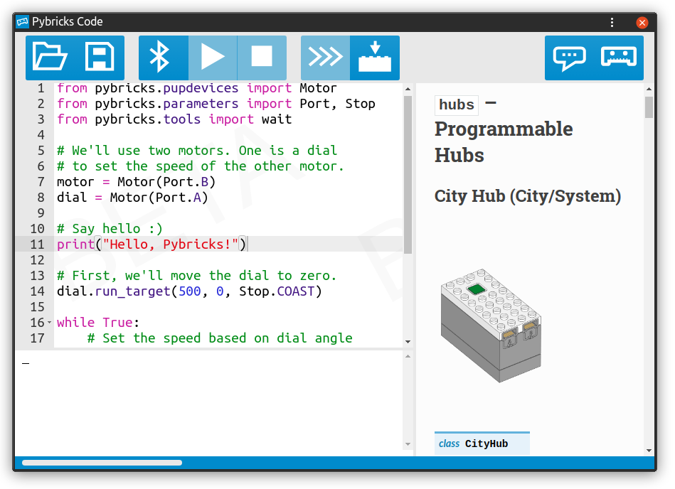

 

pybricks-code
=============

A Web App for programming LEGO® Powered Up smart hubs using Pybricks MicroPython.

**Try it at <https://code.pybricks.com> or the latest updates <https://beta.pybricks.com>.**

# Contributing

If you'd like to contribute, please fork the repository and use a feature branch. Pull requests are warmly welcome.

For more details, see the file [CONTRIBUTING.md](./CONTRIBUTING.md).

---

<small>
LEGO® is a trademark of the LEGO Group of companies which does not sponsor, authorize or endorse this project.
</small>
